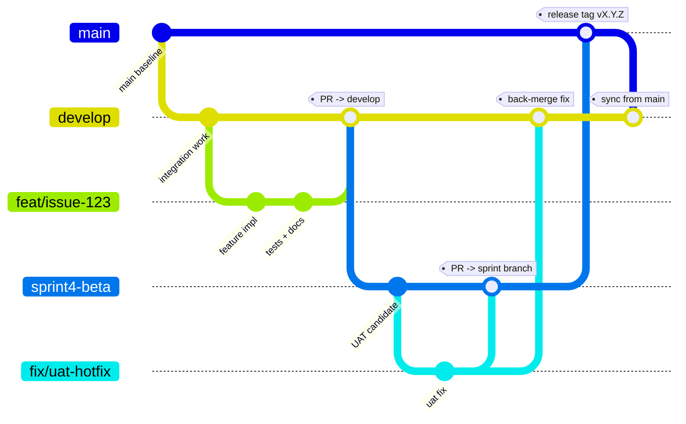

# Gater Robot

Run 4 terminals (outside vscode to avoid port forwarding fights with remote-ssh)
```sh
cloudflared tunnel run gater
pnpm convex dev
pnpm --filter @gater/webapp dev
pnpm -F @gater/bot
```
BEST Token: https://basescan.org/address/0x8a0B10A0164CDfd633b914eFb36D338C3CD17F14#code

## Branching, PR, and release pattern



Flow summary:
- `develop` is the default integration branch
- feature branches are cut from `develop` and merged to `develop` via PR
- sprint/release candidate branches (e.g. `sprint4-beta`, `sprint2-rc`) are cut from `develop` for UAT
- fixes found during UAT are merged to sprint branch and back-merged to `develop`
- final release is merged from sprint branch to `main` and tagged, then `main` is synced back into `develop`

>**Elevator pitch**
>
>We’re building **Telegram’s missing identity + access layer for crypto communities**: a bot and mini-app that lets admins create **token-gated private channels** in under a minute, and lets users join in seconds.
>
>Members verify wallet ownership with **SIWE**, link multiple addresses, and choose a “favorite” **ENS** identity that shows up inside Telegram. Admins set a simple rule—like “hold 2,000 $BEST”—and our system continuously revalidates membership, warning and removing users who fall below the threshold.
>
>The killer part is the recovery loop: if you’re not eligible, we don’t just reject you—we give you a one-click **Get Eligible** flow so you can swap/bridge into the required token and rejoin instantly. Powered by: **LiFi**.
>
>Today it’s token thresholds; next it’s **USDC membership fees/subscriptions**, community analytics, and fully programmable engagement—turning Telegram groups into real, enforceable, monetizable communities.
>

---

Open in Telegram [@GaterRobot](https://t.me/gaterrobot)

---

## Development tunnel (Cloudflare Tunnel)

Telegram Mini Apps must be served from a **public HTTPS URL** during development. We use Cloudflare Quick Tunnel
to expose the local Mini App so it can be opened inside Telegram.

**Prereqs**
- Install `cloudflared` (https://developers.cloudflare.com/cloudflare-one/connections/connect-apps/install-and-setup/installation/)

**Run the Mini App and tunnel**
```bash
# terminal 1: run the web app (assumes it starts on :5173)
pnpm --filter @gater/webapp dev

# terminal 2: expose it publicly (named tunnel)
cloudflared tunnel run gater
```

Dev URL: `https://gater-dev.agentix.bot`  
Prod URL: `https://gater-app.agentix.bot`

---

## Hackathon plan

See `docs/FINAL_PLAN.md` for the reconciled 5‑day demo plan and where the older planning docs diverge.

---

## Webapp migration

`apps/web` has been removed. `apps/webapp` is the only maintained mini-app.
See `docs/WEBAPP_MIGRATION_PLAN.md` for historical migration notes.

---

## Credits

- **Scaffold-ETH 2** — multi-chain dapp patterns and tooling inspiration.
- **ethid.org** / **ethereum-identity-kit** — identity + SIWE UX building blocks.
- **ENS** — Ethereum identity primitives and ecosystem.
- **LI.FI** — cross-chain swap/bridge infrastructure and widget.
- **ETHGlobal Hacker Pass NFT** — hackathon participation and access.
