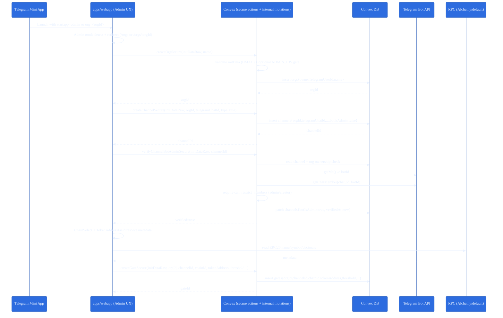
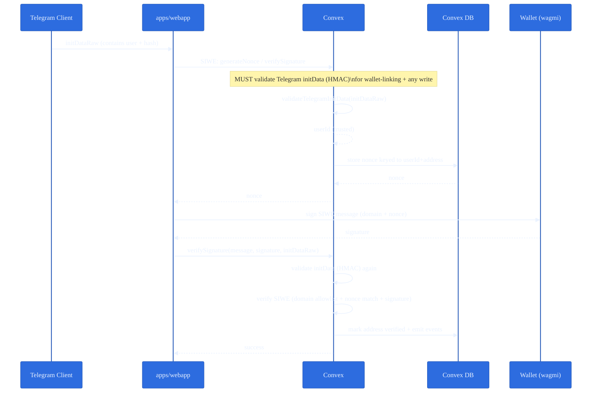
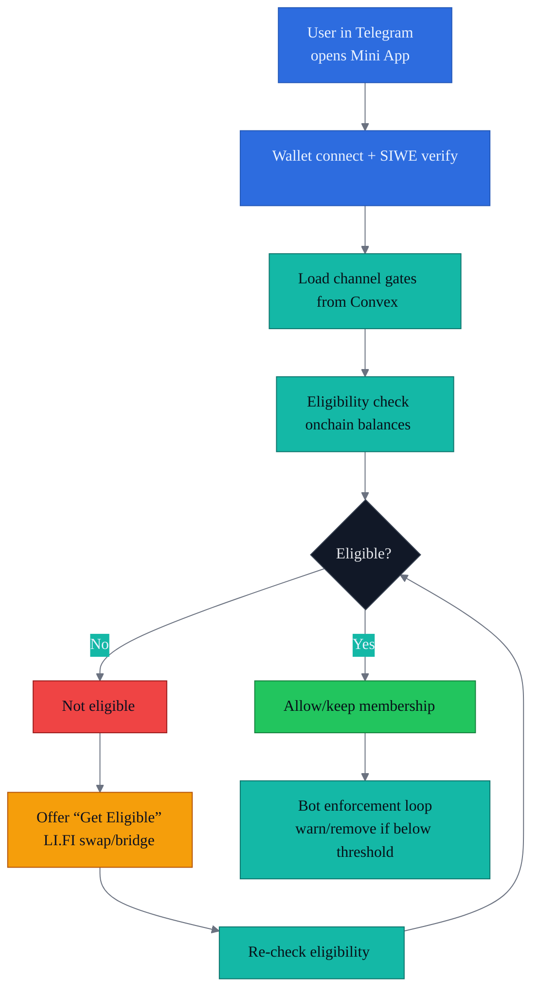
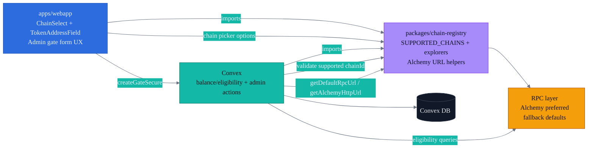

# Gater Robot — Architecture Diagrams (Slide-Ready)

These diagrams are designed to be **presentation-friendly**:
- dark background
- consistent accent colors per subsystem
- exports cleanly to SVG

## How to use (slides)

1) Paste a diagram into Mermaid Live Editor.
2) Export as **SVG** (preferred for crisp scaling).
3) Drop SVG into Google Slides / Keynote / PowerPoint.

## Theme (shared across all diagrams)

All diagrams below use the same Mermaid `init` theme variables:
- background: `#0B1020`
- webapp/UI: `#2D6CDF`
- Convex/services: `#14B8A6`
- external services: `#A78BFA`
- chains/RPC: `#F59E0B`

---

## Slide 1 — Master: System Context (what talks to what)

```mermaid
%%{init: {"theme":"base","themeVariables":{
  "background":"#0B1020",
  "primaryColor":"#2D6CDF",
  "primaryTextColor":"#EAF2FF",
  "primaryBorderColor":"#2559B8",
  "lineColor":"#6B7280",
  "secondaryColor":"#14B8A6",
  "tertiaryColor":"#A78BFA",
  "fontFamily":"Inter, ui-sans-serif, system-ui"
}}}%%
flowchart LR
  classDef app fill:#2D6CDF,stroke:#2559B8,color:#EAF2FF;
  classDef convex fill:#14B8A6,stroke:#0F766E,color:#071018;
  classDef ext fill:#A78BFA,stroke:#7C3AED,color:#0B1020;
  classDef chain fill:#F59E0B,stroke:#B45309,color:#0B1020;
  classDef db fill:#111827,stroke:#374151,color:#E5E7EB;

  TG[Telegram Client<br/>Mini App WebView]:::ext
  WEB[apps/webapp<br/>Vite + React + shadcn/ui<br/>Router + Providers]:::app

  CONVEX[Convex Backend<br/>Queries + Mutations + Node Actions]:::convex
  DB[(Convex DB<br/>orgs / channels / gates / memberships / addresses)]:::db

  RPC[RPC Providers<br/>Alchemy (preferred) / defaults]:::chain
  EVM[EVM Networks<br/>25+ supported chains]:::chain
  BOTAPI[Telegram Bot API<br/>getMe / getChatMember]:::ext

  LI[LI.FI Widget<br/>Swap/Bridge UX]:::ext
  ENS[ENS + Public RPC<br/>Name/Avatar/Records]:::ext
  WALLET[Wallets<br/>Injected / WalletConnect]:::ext

  TG -->|startParam + initDataRaw| WEB
  WEB -->|queries/secure actions| CONVEX
  CONVEX --> DB

  WEB -->|wagmi/viem calls| RPC
  RPC --> EVM

  CONVEX -->|balance/eligibility checks| RPC
  WEB --> LI
  WEB --> ENS
  WEB --> WALLET

  CONVEX -->|bot permission verify| BOTAPI
```

---

## Slide 2 — Zoom-in: Admin Onboarding + Gate Creation (happy path)



---

## Slide 3 — Zoom-in: Telegram InitData + SIWE Wallet Linking (secure boundary)

This zoom highlights why we treat **writes** differently than **reads**:
- Queries can parse identity for UX (non-cryptographic).
- Any wallet linking or admin writes must validate Telegram **HMAC initData**.



---

## Slide 4 — Zoom-in: Eligibility + “Get Eligible” Loop (user journey + enforcement)



---

## Slide 5 — Zoom-in: Chain Registry as a Single Source of Truth



