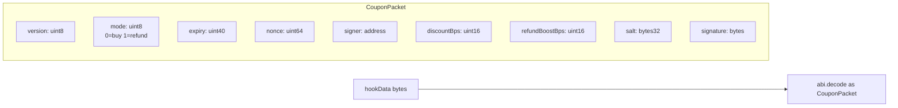
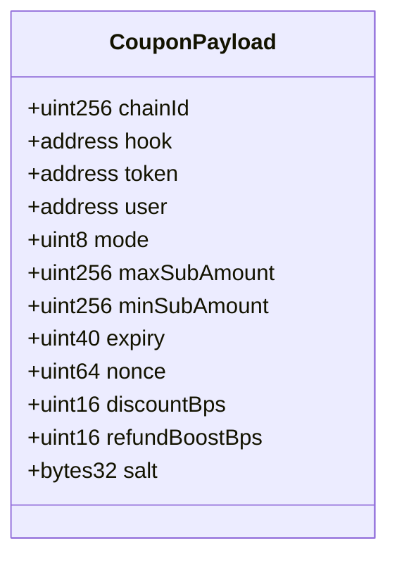
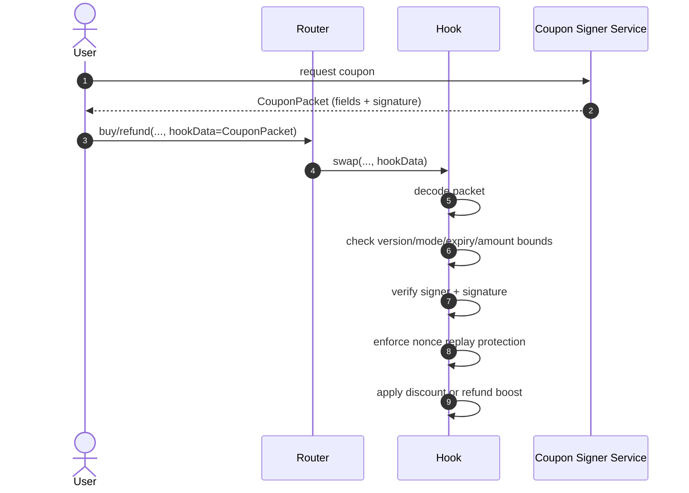

# Coupon Packet Diagram (Planned `hookData` Extension)

Coupons are not enabled in the current contracts, but the router/hook already pass `hookData`.
This document defines a clean packet format for future coupon support.

## Packet structure (ABI-encoded)

## Logical payload to sign

## Validation/data flow in swap path

## Notes for implementation
1. Keep packet versioned (`version`) for forwards compatibility.
2. Bind signatures to both `chainId` and `hook` to avoid cross-chain/cross-hook replay.
3. Nonce should be consumed on first use (on-chain mapping keyed by signer+user+nonce).
4. Cap `discountBps` and `refundBoostBps` to safe ranges (e.g., max 10_000 bps).
