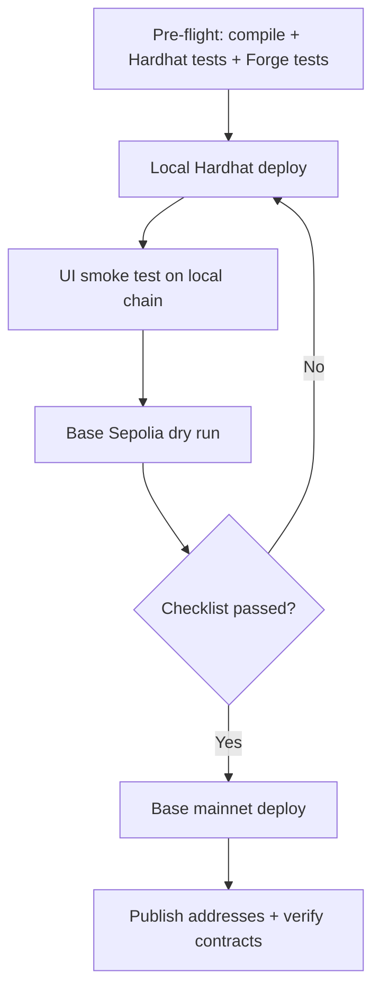

# Subscriptions v4: Judge Brief

This project implements a Uniswap v4 hook-powered subscription system with:
- decaying `SUB` balances
- exact-output buys (`buyExactOut`)
- exact-input refunds (`refundExactIn`, `refundAll`, `refundUpTo`)
- deterministic deploy scripts for local, testnet, and mainnet

## Why this is interesting
- Pricing and refund logic are enforced on-chain in the hook.
- Refund UX is protected against stale balance issues via `refundAll` (live balance read in transaction).
- Deployment flow is reproducible with scripts and clear promotion gates (Local -> Base Sepolia -> Base mainnet).

## 1) Deployment and validation flow



## 2) Hook timing/sequence (buy + refund)

```mermaid
sequenceDiagram
    autonumber
    actor User
    participant Router as SubscriptionRouter
    participant PM as Uniswap v4 PoolManager
    participant Hook as SubscriptionHook
    participant SUB as SubscriptionDaysToken
    participant USDC as USDC

    rect rgb(30,55,90)
    Note over User,USDC: BUY (exact output SUB)
    User->>Router: buyExactOut(subOut, maxUsdcIn)
    Router->>Hook: quoteBuyExactOut(subOut)
    Router->>PM: sync+settle USDC from user
    Router->>PM: swap(exact output SUB)
    PM->>Hook: beforeSwap
    Hook->>PM: take(USDC) into hook reserves
    Hook->>SUB: mint(subOut) to PoolManager
    Hook-->>PM: return custom delta (pool math no-op)
    PM-->>Router: swap done
    Router->>PM: take(SUB) to user
    end

    rect rgb(90,55,30)
    Note over User,USDC: REFUND (exact input SUB)
    User->>Router: refundExactIn(...) or refundAll(...)
    Note over Router: refundAll reads live balanceOf(user)
    Router->>Hook: quoteRefundExactIn(subIn)
    Router->>PM: sync+settle SUB from user
    Router->>PM: swap(exact input SUB)
    PM->>Hook: beforeSwap
    Hook->>Hook: check refund reserves
    Hook->>PM: settle USDC payout into PoolManager
    Hook->>PM: take(SUB) from PoolManager
    Hook->>SUB: burn(subIn)
    Hook-->>PM: return custom delta (pool math no-op)
    PM-->>Router: swap done
    Router->>PM: take(USDC) to user
    end
```



## Judge reproduction (minimal)

### Local (Hardhat)
```bash
pnpm --filter @gater/contracts node:hardhat
pnpm --filter @gater/contracts deploy:subs:local:stack
pnpm --filter @gater/contracts deploy:subs:create-token:local
pnpm --filter @gater/contracts mine:hook-salt
pnpm --filter @gater/contracts deploy:subs:create:local
pnpm --filter @gater/contracts deploy:subs:demo:local
```

### Promotion gates
1. Local flow passes end-to-end.
2. Repeat on Base Sepolia.
3. Deploy same flow to Base mainnet.

## Key scripts
- `packages/contracts/script/DeployLocalSubscriptionsStack.s.sol`
- `packages/contracts/script/CreateSubscriptionToken.s.sol`
- `packages/contracts/script/MineHookSalt.s.sol`
- `packages/contracts/script/CreateSubscriptionProduct.s.sol`
- `packages/contracts/script/DemoBuyRefund.s.sol`
