# Subscriptions Deploy Workflow

This runbook is the canonical flow for deploying and validating the v4 subscriptions stack in this repo.

## Hook Swap Sequence (Judge View)

This is the core runtime behavior for buy/refund with custom v4 hook accounting.

```mermaid
sequenceDiagram
    autonumber
    actor U as User
    participant R as SubscriptionRouter
    participant PM as Uniswap v4 PoolManager
    participant H as SubscriptionHook
    participant SUB as SubscriptionDaysToken
    participant USDC as USDC Token

    rect rgb(32, 54, 92)
      Note over U,USDC: BUY (exact output SUB)
      U->>R: buyExactOut(token, subOut, maxUsdcIn, ...)
      R->>H: quoteBuyExactOut(subOut)
      H-->>R: usdcIn
      R->>PM: sync(USDC) + settle(prepay USDC from user)
      R->>PM: swap(exactOutput SUB)
      PM->>H: beforeSwap(...)
      H->>H: validate pool key + authorized router + mode
      H->>PM: take(USDC -> Hook reserves)
      H->>SUB: mint(PoolManager, subOut)
      H->>PM: settle(SUB funding)
      H-->>PM: return beforeSwap delta (no-op pool math)
      PM-->>R: swap complete
      R->>PM: take(SUB -> user)
      R-->>U: SUB delivered
    end

    rect rgb(72, 50, 32)
      Note over U,USDC: REFUND (exact input SUB)
      U->>R: refundExactIn(...) or refundAll(...)
      Note over R: refundAll reads live balanceOf(user) in-tx
      R->>H: quoteRefundExactIn(subIn)
      H-->>R: usdcOut
      R->>PM: sync(SUB) + settle(prepay SUB from user)
      R->>PM: swap(exactInput SUB)
      PM->>H: beforeSwap(...)
      H->>H: validate + check USDC reserves
      H->>PM: sync(USDC) + settle(push USDC payout)
      H->>PM: take(SUB -> Hook)
      H->>SUB: burn(subIn)
      H-->>PM: return beforeSwap delta (no-op pool math)
      PM-->>R: swap complete
      R->>PM: take(USDC -> user)
      R-->>U: USDC delivered
    end
```



## Scope
- Contracts package: `packages/contracts`
- Local chain: Hardhat node (`127.0.0.1:8545`)
- Testnet: Base Sepolia
- Mainnet: Base

## Prerequisites
1. Install deps:
```bash
pnpm install
```
2. Ensure Foundry is installed (`forge --version` works).
3. Create env file:
```bash
cp packages/contracts/.env.example packages/contracts/.env
```

## 0) Pre-flight checks (always run first)
```bash
pnpm --filter @gater/contracts build
pnpm --filter @gater/contracts test
pnpm --filter @gater/contracts test:forge
```

---

## 1) Local deploy on Hardhat chain (recommended first)

### 1.1 Start local chain
```bash
pnpm --filter @gater/contracts node:hardhat
```

### 1.2 Configure local env
In `packages/contracts/.env`:
- `PRIVATE_KEY`: first account private key from Hardhat node output
- optional defaults:
  - `DEFAULT_FEE=0`
  - `DEFAULT_TICK_SPACING=1`
  - `LOCAL_USDC_MINT=2000000000000`

### 1.3 Deploy local core stack
Deploys: `PoolManager + MockUSDC + Factory + Router`
```bash
pnpm --filter @gater/contracts deploy:subs:local:stack
```
Copy printed addresses into `packages/contracts/.env`:
- `POOL_MANAGER`
- `USDC`
- `FACTORY`
- `ROUTER`

### 1.4 Create token
```bash
pnpm --filter @gater/contracts deploy:subs:create-token:local
```
Copy printed token address into:
- `SUB_TOKEN`

### 1.5 Mine hook salt
```bash
pnpm --filter @gater/contracts mine:hook-salt
```
Copy printed salt into:
- `HOOK_SALT`

### 1.6 Setup pool + hook + token role wiring
```bash
pnpm --filter @gater/contracts deploy:subs:create:local
```

### 1.7 Run buy/refund demo
```bash
pnpm --filter @gater/contracts deploy:subs:demo:local
```

---

## 2) UI local run (for manual verification)

### 2.1 Configure app env
```bash
cp apps/sub-store/.env.example apps/sub-store/.env
```
Set in `apps/sub-store/.env`:
```env
VITE_CHAIN_ID=31337
VITE_CHAIN_NAME=Hardhat Local
VITE_RPC_URL=http://127.0.0.1:8545
VITE_EXPLORER_URL=
VITE_FACTORY_ADDRESS=0x...
VITE_HOOK_ADDRESS=0x...
VITE_USDC_ADDRESS=0x...
VITE_SUB_TOKEN_ADDRESS=0x...
```

### 2.2 Start frontend
```bash
pnpm --filter @gater/sub-store dev
```
Open `http://localhost:5173`.

---

## 3) Base Sepolia dry run

### 3.1 Env setup
In `packages/contracts/.env` set:
- `PRIVATE_KEY` (funded on Base Sepolia)
- `POOL_MANAGER` (v4 pool manager for network)
- `USDC` (token address for testing path)
- `FACTORY` / `ROUTER` after infra deploy
- pricing vars as needed (`BASE_PRICE_USDC`, `REFUND_PRICE_USDC`, etc.)

### 3.2 Deploy infra
```bash
pnpm --filter @gater/contracts deploy:subs:infra
```
Copy printed `Factory` / `Router` into env.

### 3.3 Create token -> mine salt -> setup
```bash
pnpm --filter @gater/contracts deploy:subs:create-token
pnpm --filter @gater/contracts mine:hook-salt
pnpm --filter @gater/contracts deploy:subs:create
pnpm --filter @gater/contracts deploy:subs:demo
```

### 3.4 Save deployment metadata
Update `packages/contracts/deployments/subscriptions.json` with final addresses.

---

## 4) Base mainnet deploy (only after Sepolia success)

Use the same sequence as Sepolia, but with:
- Base mainnet RPC and funded deployer
- intended production `USDC`
- conservative pricing and refund settings

Order:
1. `deploy:subs:infra`
2. `deploy:subs:create-token`
3. `mine:hook-salt`
4. `deploy:subs:create`
5. (optional) `deploy:subs:demo` only if appropriate for funded test wallet

Then:
1. verify contracts
2. update `packages/contracts/deployments/subscriptions.json`
3. sync/announce addresses for consuming apps.

---

## Troubleshooting

### `invalid solc version ... =0.8.26`
- Use current scripts; local stack command already forces `--use 0.8.26`.
- `foundry.toml` is configured with `auto_detect_solc = true`.

### Hook salt issues
- Preferred: explicitly set `SUB_TOKEN` before `mine:hook-salt`.
- Fallback: set `FACTORY`; script can predict token from factory nonce.

### Generated files
- Foundry broadcast output is ignored via `.gitignore`:
  - `packages/contracts/broadcast/`
