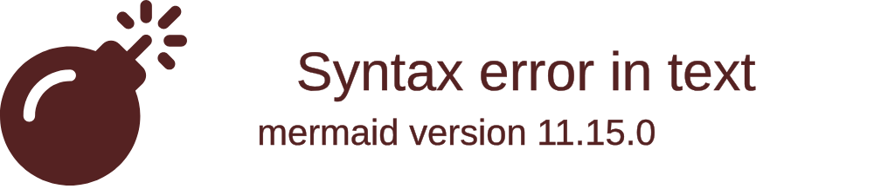

# Telegram + Mini App + Convex (Mermaid Architecture)

This is the same system represented with Mermaid's `architecture-beta` syntax.

```mermaid
architecture-beta
    group users(cloud)[Users]
    group telegram(cloud)[Telegram Platform]
    group gater(cloud)[Gater Robot]
    group convex(cloud)[Convex]
    group web3(cloud)[Web3 Services]

    service admin(internet)[Admin] in users
    service member(internet)[Member] in users

    service tgBot(internet)[Bot API] in telegram
    service tgWeb(internet)[Mini App Host] in telegram

    service bot(server)[Bot Service] in gater
    service mini(server)[Mini App Frontend] in gater

    service cxApi(server)[Functions / Actions] in convex
    service cxDb(database)[Convex DB] in convex

    service rpc(internet)[RPC Providers] in web3
    service lifi(internet)[LI.FI] in web3
    service ens(internet)[ENS] in web3

    admin:R --> L:tgBot
    member:R --> L:tgWeb

    tgBot:R --> L:bot
    tgWeb:R --> L:mini

    bot:R --> L:cxApi
    mini:R --> L:cxApi
    cxApi:B --> T:cxDb

    cxApi:R --> L:rpc
    mini:B --> T:rpc
    mini:B --> T:lifi
    mini:B --> T:ens
```
