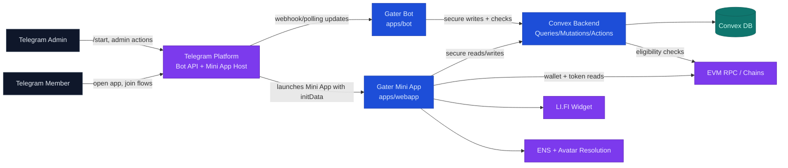
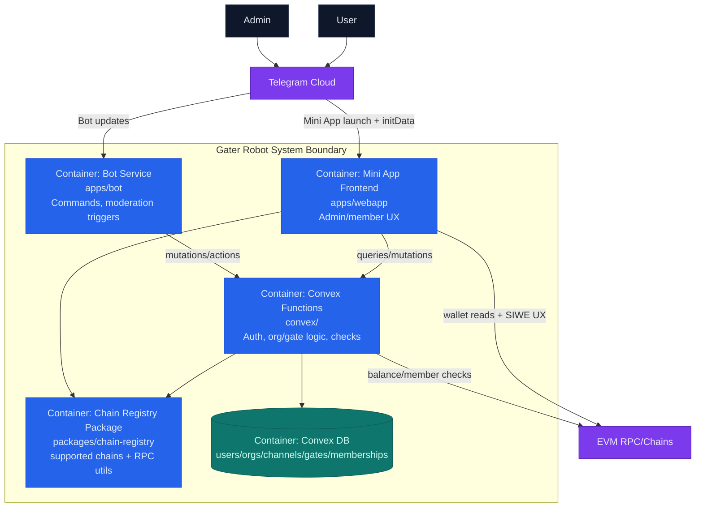

# Telegram + Mini App + Convex (C4)

This is a C4-style view of the current system for judges.

## C4 Level 1: System Context

## C4 Level 2: Container View (Inside Gater System)

## What judges should notice

1. Telegram identity is the UX entrypoint; trust decisions are enforced server-side in Convex.
2. Convex is the policy engine: admin writes, channel config, and eligibility checks.
3. Bot and Mini App are separate containers sharing one backend state model.
4. On-chain checks are externalized via RPC/chains, while Telegram control remains through Bot API.
